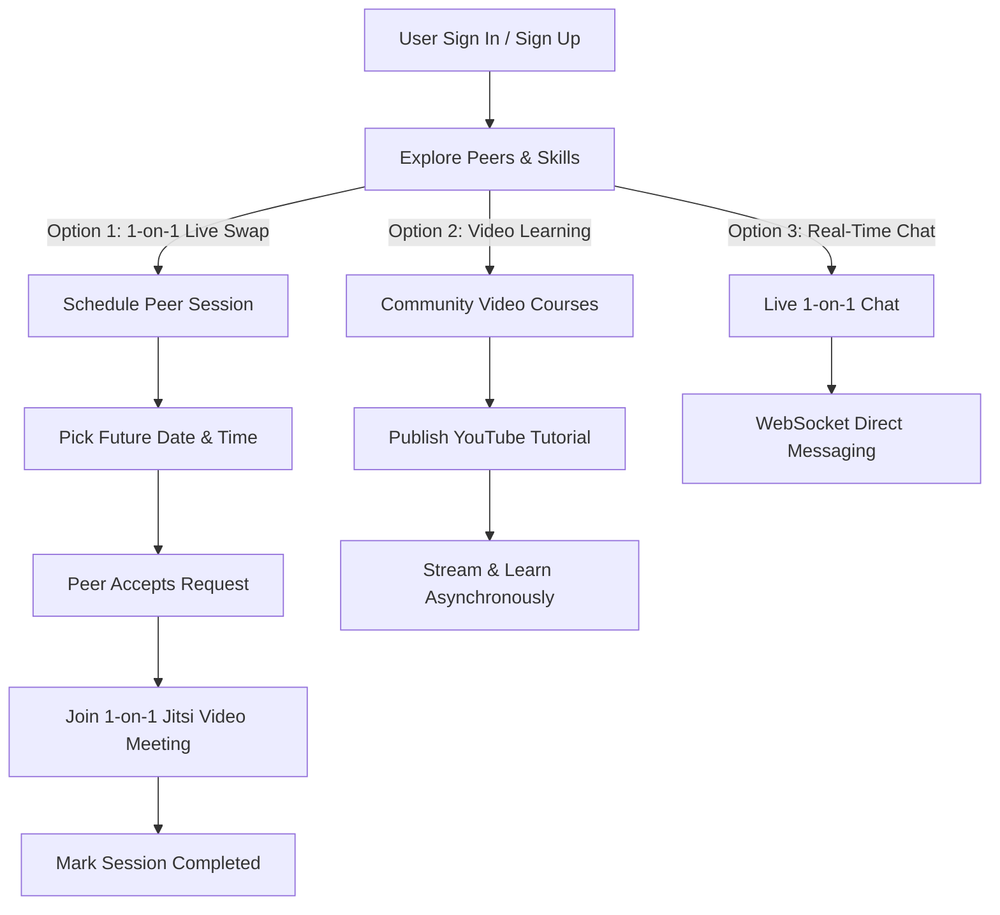

# 🚀 SkillOrbit — Peer-to-Peer Skill Swapping Platform

**SkillOrbit** is a modern, full-stack peer-to-peer skill sharing platform built with Django. It connects learners and mentors through **1-on-1 scheduled pair learning sessions**, **community video courses**, and **real-time peer messaging**.

---

## ✨ Key Features

- 📅 **1-on-1 Peer Sessions**: Schedule 1-on-1 skill swap sessions with peers using a custom cross-browser Date & Time picker, interactive status badges (`Pending`, `Accepted`, `Completed`), and instant Jitsi Video meeting rooms.
- 📺 **Community Video Courses**: Browse and publish video tutorials with YouTube thumbnail preview cards and embedded playback.
- 💬 **Real-Time Peer Chat**: Instant 1-on-1 messaging powered by WebSockets and Django Channels.
- 🌐 **Community Forum & Requests**: Post skill request topics, comment, and connect with peers.
- 🎨 **Material Design 3 Theme**: Responsive, dark-mode design system optimized for desktop and mobile browsers.

---

## 🔄 Platform Workflow



---

## 🛠️ Tech Stack

- **Backend**: Python 3.14, Django 6.0, ASGI / Daphne
- **Database**: PostgreSQL / SQLite3
- **Real-Time**: Django Channels & Redis / InMemory Channel Layer
- **Video Meetings**: Jitsi Meet Integration
- **Frontend**: HTML5, Vanilla CSS3 (Material Design 3 Tokens), JavaScript (ES6)

---

## 🚀 Quick Setup & Installation

### 1. Clone & Set Up Environment
```bash
git clone https://github.com/saraths3/SkillOrbit.git
cd SkillOrbit

# Create & activate virtual environment
python -m venv venv
source venv/bin/activate
```

### 2. Install Dependencies
```bash
pip install -r requirements.txt
```

### 3. Database Migration
```bash
python SkillOrbit/manage.py migrate
```

### 4. Run Development Server
```bash
python SkillOrbit/manage.py runserver
```
Visit `http://127.0.0.1:8000/` in your browser!

---

## 📄 License

This project is licensed under the MIT License.
